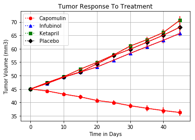
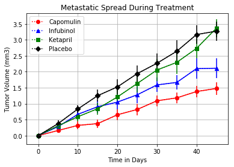
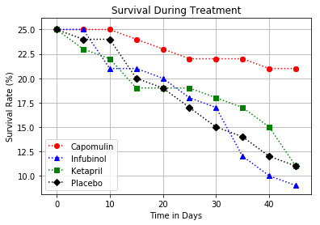
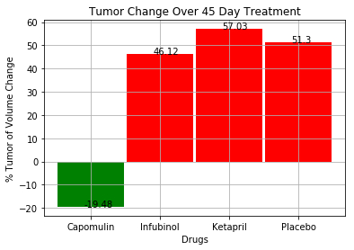

```python
# Dependencies and Setup
%matplotlib inline
import matplotlib.pyplot as plt
import pandas as pd
import numpy as np

# Hide warning messages in notebook
import warnings
warnings.filterwarnings('ignore')

# File to Load (Remember to Change These)
mouse_data = "data/mouse_drug_data.csv"
clinical_data = "data/clinicaltrial_data.csv"

# Read the Mouse and Drug Data 

mousedata_df = pd.read_csv(mouse_data)
mousedata_df.head()
```


<div>
<style scoped>
    .dataframe tbody tr th:only-of-type {
        vertical-align: middle;
    }

    .dataframe tbody tr th {
        vertical-align: top;
    }

    .dataframe thead th {
        text-align: right;
    }
</style>
<table border="1" class="dataframe">
  <thead>
    <tr style="text-align: right;">
      <th></th>
      <th>Mouse ID</th>
      <th>Drug</th>
    </tr>
  </thead>
  <tbody>
    <tr>
      <th>0</th>
      <td>f234</td>
      <td>Stelasyn</td>
    </tr>
    <tr>
      <th>1</th>
      <td>x402</td>
      <td>Stelasyn</td>
    </tr>
    <tr>
      <th>2</th>
      <td>a492</td>
      <td>Stelasyn</td>
    </tr>
    <tr>
      <th>3</th>
      <td>w540</td>
      <td>Stelasyn</td>
    </tr>
    <tr>
      <th>4</th>
      <td>v764</td>
      <td>Stelasyn</td>
    </tr>
  </tbody>
</table>
</div>


```python
# Read the Clinical Trial Data
cd_df = pd.read_csv(clinical_data)
cd_df.head()
```


<div>
<style scoped>
    .dataframe tbody tr th:only-of-type {
        vertical-align: middle;
    }

    .dataframe tbody tr th {
        vertical-align: top;
    }

    .dataframe thead th {
        text-align: right;
    }
</style>
<table border="1" class="dataframe">
  <thead>
    <tr style="text-align: right;">
      <th></th>
      <th>Mouse ID</th>
      <th>Timepoint</th>
      <th>Tumor Volume (mm3)</th>
      <th>Metastatic Sites</th>
    </tr>
  </thead>
  <tbody>
    <tr>
      <th>0</th>
      <td>b128</td>
      <td>0</td>
      <td>45.0</td>
      <td>0</td>
    </tr>
    <tr>
      <th>1</th>
      <td>f932</td>
      <td>0</td>
      <td>45.0</td>
      <td>0</td>
    </tr>
    <tr>
      <th>2</th>
      <td>g107</td>
      <td>0</td>
      <td>45.0</td>
      <td>0</td>
    </tr>
    <tr>
      <th>3</th>
      <td>a457</td>
      <td>0</td>
      <td>45.0</td>
      <td>0</td>
    </tr>
    <tr>
      <th>4</th>
      <td>c819</td>
      <td>0</td>
      <td>45.0</td>
      <td>0</td>
    </tr>
  </tbody>
</table>
</div>


```python
# Combine the data into a single dataset
merged_df = cd_df.merge(mousedata_df, on="Mouse ID", how = 'inner')

# Display the data table for preview
merged_df.head()
```


<div>
<style scoped>
    .dataframe tbody tr th:only-of-type {
        vertical-align: middle;
    }

    .dataframe tbody tr th {
        vertical-align: top;
    }

    .dataframe thead th {
        text-align: right;
    }
</style>
<table border="1" class="dataframe">
  <thead>
    <tr style="text-align: right;">
      <th></th>
      <th>Mouse ID</th>
      <th>Timepoint</th>
      <th>Tumor Volume (mm3)</th>
      <th>Metastatic Sites</th>
      <th>Drug</th>
    </tr>
  </thead>
  <tbody>
    <tr>
      <th>0</th>
      <td>b128</td>
      <td>0</td>
      <td>45.000000</td>
      <td>0</td>
      <td>Capomulin</td>
    </tr>
    <tr>
      <th>1</th>
      <td>b128</td>
      <td>5</td>
      <td>45.651331</td>
      <td>0</td>
      <td>Capomulin</td>
    </tr>
    <tr>
      <th>2</th>
      <td>b128</td>
      <td>10</td>
      <td>43.270852</td>
      <td>0</td>
      <td>Capomulin</td>
    </tr>
    <tr>
      <th>3</th>
      <td>b128</td>
      <td>15</td>
      <td>43.784893</td>
      <td>0</td>
      <td>Capomulin</td>
    </tr>
    <tr>
      <th>4</th>
      <td>b128</td>
      <td>20</td>
      <td>42.731552</td>
      <td>0</td>
      <td>Capomulin</td>
    </tr>
  </tbody>
</table>
</div>


## Tumor Response to Treatment


```python
# Store the Mean Tumor Volume Data Grouped by Drug and Timepoint 
mean_tumor_volume = merged_df.groupby(['Drug', 'Timepoint'])['Tumor Volume (mm3)'].mean()
mean_tumor_volume

# Convert to DataFrame
mean_tumor_volume_df = pd.DataFrame(mean_tumor_volume) 

# Preview DataFrame
mean_tumor_volume_df.head()
```


<div>
<style scoped>
    .dataframe tbody tr th:only-of-type {
        vertical-align: middle;
    }

    .dataframe tbody tr th {
        vertical-align: top;
    }

    .dataframe thead th {
        text-align: right;
    }
</style>
<table border="1" class="dataframe">
  <thead>
    <tr style="text-align: right;">
      <th></th>
      <th></th>
      <th>Tumor Volume (mm3)</th>
    </tr>
    <tr>
      <th>Drug</th>
      <th>Timepoint</th>
      <th></th>
    </tr>
  </thead>
  <tbody>
    <tr>
      <th rowspan="5" valign="top">Capomulin</th>
      <th>0</th>
      <td>45.000000</td>
    </tr>
    <tr>
      <th>5</th>
      <td>44.266086</td>
    </tr>
    <tr>
      <th>10</th>
      <td>43.084291</td>
    </tr>
    <tr>
      <th>15</th>
      <td>42.064317</td>
    </tr>
    <tr>
      <th>20</th>
      <td>40.716325</td>
    </tr>
  </tbody>
</table>
</div>


```python
# Store the Standard Error of Tumor Volumes Grouped by Drug and Timepoint
std_error_tumor_volume = merged_df.groupby(['Drug', 'Timepoint'])['Tumor Volume (mm3)'].sem()

# Convert to DataFrame
std_error_tumor_volume_df = pd.DataFrame(std_error_tumor_volume)

# # Preview DataFrame
std_error_tumor_volume_df.head()
```


<div>
<style scoped>
    .dataframe tbody tr th:only-of-type {
        vertical-align: middle;
    }

    .dataframe tbody tr th {
        vertical-align: top;
    }

    .dataframe thead th {
        text-align: right;
    }
</style>
<table border="1" class="dataframe">
  <thead>
    <tr style="text-align: right;">
      <th></th>
      <th></th>
      <th>Tumor Volume (mm3)</th>
    </tr>
    <tr>
      <th>Drug</th>
      <th>Timepoint</th>
      <th></th>
    </tr>
  </thead>
  <tbody>
    <tr>
      <th rowspan="5" valign="top">Capomulin</th>
      <th>0</th>
      <td>0.000000</td>
    </tr>
    <tr>
      <th>5</th>
      <td>0.448593</td>
    </tr>
    <tr>
      <th>10</th>
      <td>0.702684</td>
    </tr>
    <tr>
      <th>15</th>
      <td>0.838617</td>
    </tr>
    <tr>
      <th>20</th>
      <td>0.909731</td>
    </tr>
  </tbody>
</table>
</div>


```python
# Minor Data Munging to Re-Format the Data Frames
merged_df_mung = pd.pivot_table(merged_df, index=['Timepoint'], columns=['Drug']) 

# Preview that Reformatting worked
merged_df_mung = merged_df_mung.loc[ : , 'Tumor Volume (mm3)']
merged_df_mung
```


<div>
<style scoped>
    .dataframe tbody tr th:only-of-type {
        vertical-align: middle;
    }

    .dataframe tbody tr th {
        vertical-align: top;
    }

    .dataframe thead th {
        text-align: right;
    }
</style>
<table border="1" class="dataframe">
  <thead>
    <tr style="text-align: right;">
      <th>Drug</th>
      <th>Capomulin</th>
      <th>Ceftamin</th>
      <th>Infubinol</th>
      <th>Ketapril</th>
      <th>Naftisol</th>
      <th>Placebo</th>
      <th>Propriva</th>
      <th>Ramicane</th>
      <th>Stelasyn</th>
      <th>Zoniferol</th>
    </tr>
    <tr>
      <th>Timepoint</th>
      <th></th>
      <th></th>
      <th></th>
      <th></th>
      <th></th>
      <th></th>
      <th></th>
      <th></th>
      <th></th>
      <th></th>
    </tr>
  </thead>
  <tbody>
    <tr>
      <th>0</th>
      <td>45.000000</td>
      <td>45.000000</td>
      <td>45.000000</td>
      <td>45.000000</td>
      <td>45.000000</td>
      <td>45.000000</td>
      <td>45.000000</td>
      <td>45.000000</td>
      <td>45.000000</td>
      <td>45.000000</td>
    </tr>
    <tr>
      <th>5</th>
      <td>44.266086</td>
      <td>46.503051</td>
      <td>47.062001</td>
      <td>47.389175</td>
      <td>46.796098</td>
      <td>47.125589</td>
      <td>47.248967</td>
      <td>43.944859</td>
      <td>47.527452</td>
      <td>46.851818</td>
    </tr>
    <tr>
      <th>10</th>
      <td>43.084291</td>
      <td>48.285125</td>
      <td>49.403909</td>
      <td>49.582269</td>
      <td>48.694210</td>
      <td>49.423329</td>
      <td>49.101541</td>
      <td>42.531957</td>
      <td>49.463844</td>
      <td>48.689881</td>
    </tr>
    <tr>
      <th>15</th>
      <td>42.064317</td>
      <td>50.094055</td>
      <td>51.296397</td>
      <td>52.399974</td>
      <td>50.933018</td>
      <td>51.359742</td>
      <td>51.067318</td>
      <td>41.495061</td>
      <td>51.529409</td>
      <td>50.779059</td>
    </tr>
    <tr>
      <th>20</th>
      <td>40.716325</td>
      <td>52.157049</td>
      <td>53.197691</td>
      <td>54.920935</td>
      <td>53.644087</td>
      <td>54.364417</td>
      <td>53.346737</td>
      <td>40.238325</td>
      <td>54.067395</td>
      <td>53.170334</td>
    </tr>
    <tr>
      <th>25</th>
      <td>39.939528</td>
      <td>54.287674</td>
      <td>55.715252</td>
      <td>57.678982</td>
      <td>56.731968</td>
      <td>57.482574</td>
      <td>55.504138</td>
      <td>38.974300</td>
      <td>56.166123</td>
      <td>55.432935</td>
    </tr>
    <tr>
      <th>30</th>
      <td>38.769339</td>
      <td>56.769517</td>
      <td>58.299397</td>
      <td>60.994507</td>
      <td>59.559509</td>
      <td>59.809063</td>
      <td>58.196374</td>
      <td>38.703137</td>
      <td>59.826738</td>
      <td>57.713531</td>
    </tr>
    <tr>
      <th>35</th>
      <td>37.816839</td>
      <td>58.827548</td>
      <td>60.742461</td>
      <td>63.371686</td>
      <td>62.685087</td>
      <td>62.420615</td>
      <td>60.350199</td>
      <td>37.451996</td>
      <td>62.440699</td>
      <td>60.089372</td>
    </tr>
    <tr>
      <th>40</th>
      <td>36.958001</td>
      <td>61.467895</td>
      <td>63.162824</td>
      <td>66.068580</td>
      <td>65.600754</td>
      <td>65.052675</td>
      <td>63.045537</td>
      <td>36.574081</td>
      <td>65.356386</td>
      <td>62.916692</td>
    </tr>
    <tr>
      <th>45</th>
      <td>36.236114</td>
      <td>64.132421</td>
      <td>65.755562</td>
      <td>70.662958</td>
      <td>69.265506</td>
      <td>68.084082</td>
      <td>66.258529</td>
      <td>34.955595</td>
      <td>68.438310</td>
      <td>65.960888</td>
    </tr>
  </tbody>
</table>
</div>


```python
# Extract means for the drugs - Capomulin, Infubinol, Ketapril and Placebo
capomulin = merged_df_mung[["Capomulin"]]
capomulin_list = capomulin['Capomulin'].tolist()
capomulin_sem = std_error_tumor_volume[["Capomulin"]]
capomulin_list_sem = capomulin_sem ['Capomulin'].tolist()

infubinol = merged_df_mung[["Infubinol"]]
infubinol_list = infubinol['Infubinol'].tolist()
infubinol_sem = std_error_tumor_volume[["Infubinol"]]
infubinol_list_sem = infubinol_sem ['Infubinol'].tolist()

ketapril = merged_df_mung[["Ketapril"]]
ketapril_list = ketapril['Ketapril'].tolist()
ketapril_sem = std_error_tumor_volume[["Ketapril"]]
ketapril_list_sem = ketapril_sem ['Ketapril'].tolist()

placebo = merged_df_mung[["Placebo"]]
placebo_list = placebo['Placebo'].tolist()
placebo_sem = std_error_tumor_volume[["Placebo"]]
placebo_list_sem = placebo_sem ['Placebo'].tolist()
```


```python
# Generate the Plot (with Error Bars)
x_limit = 50
x_axis = np.arange(0, x_limit, 5)

# Create a random array of data that we will use for our y values
# grades_range = [10, 20, 30, 40, 50, 60, 70, 80, 90, 100]
plt.scatter(x_axis, capomulin_list, marker='o', color='red')
plt.plot(x_axis, capomulin_list, 'r:o', label='Capomulin')
plt.errorbar(x_axis, capomulin_list, yerr=capomulin_list_sem, color='red')

plt.scatter(x_axis, infubinol_list, marker='^', color='blue')
plt.plot(x_axis, infubinol_list, 'b:^', label='Infubinol')
plt.errorbar(x_axis, infubinol_list, yerr=infubinol_list_sem, color='red')

plt.scatter(x_axis, ketapril_list, marker='s', color='green')
plt.plot(x_axis,ketapril_list, 'g:s', label='Ketapril')
plt.errorbar(x_axis, ketapril_list, yerr=ketapril_list_sem, color='red')

plt.scatter(x_axis, placebo_list, marker='D', color='black')
plt.plot(x_axis, placebo_list, 'k:D', label='Placebo')
plt.errorbar(x_axis, placebo_list, yerr=placebo_list_sem, color='red')

plt.title("Tumor Response To Treatment")
plt.xlabel('Time in Days')
plt.ylabel('Tumor Volume (mm3)')
plt.legend()
plt.grid()

# Save the Figure
plt.savefig('Images/tumor-response-to-treatment.png')

# Show the Figure
plt.show()
```





## Metastatic Response to Treatment


```python
# Store the Mean Met. Site Data Grouped by Drug and Timepoint 
mean_metastatic_sites = merged_df.groupby(['Drug', 'Timepoint'])['Metastatic Sites'].mean()

# Convert to DataFrame
mean_metastatic_sites_df = pd.DataFrame(mean_metastatic_sites)

# Preview DataFrame
mean_metastatic_sites_df.head()
```


<div>
<style scoped>
    .dataframe tbody tr th:only-of-type {
        vertical-align: middle;
    }

    .dataframe tbody tr th {
        vertical-align: top;
    }

    .dataframe thead th {
        text-align: right;
    }
</style>
<table border="1" class="dataframe">
  <thead>
    <tr style="text-align: right;">
      <th></th>
      <th></th>
      <th>Metastatic Sites</th>
    </tr>
    <tr>
      <th>Drug</th>
      <th>Timepoint</th>
      <th></th>
    </tr>
  </thead>
  <tbody>
    <tr>
      <th rowspan="5" valign="top">Capomulin</th>
      <th>0</th>
      <td>0.000000</td>
    </tr>
    <tr>
      <th>5</th>
      <td>0.160000</td>
    </tr>
    <tr>
      <th>10</th>
      <td>0.320000</td>
    </tr>
    <tr>
      <th>15</th>
      <td>0.375000</td>
    </tr>
    <tr>
      <th>20</th>
      <td>0.652174</td>
    </tr>
  </tbody>
</table>
</div>


```python
# Store the Standard Error associated with Met. Sites Grouped by Drug and Timepoint 
metastatic_std_error = merged_df.groupby(['Drug', 'Timepoint'])['Metastatic Sites'].sem()

# Convert to DataFrame
metastatic_std_error_df = pd.DataFrame(metastatic_std_error)

# Preview DataFrame
metastatic_std_error_df.head()
```


<div>
<style scoped>
    .dataframe tbody tr th:only-of-type {
        vertical-align: middle;
    }

    .dataframe tbody tr th {
        vertical-align: top;
    }

    .dataframe thead th {
        text-align: right;
    }
</style>
<table border="1" class="dataframe">
  <thead>
    <tr style="text-align: right;">
      <th></th>
      <th></th>
      <th>Metastatic Sites</th>
    </tr>
    <tr>
      <th>Drug</th>
      <th>Timepoint</th>
      <th></th>
    </tr>
  </thead>
  <tbody>
    <tr>
      <th rowspan="5" valign="top">Capomulin</th>
      <th>0</th>
      <td>0.000000</td>
    </tr>
    <tr>
      <th>5</th>
      <td>0.074833</td>
    </tr>
    <tr>
      <th>10</th>
      <td>0.125433</td>
    </tr>
    <tr>
      <th>15</th>
      <td>0.132048</td>
    </tr>
    <tr>
      <th>20</th>
      <td>0.161621</td>
    </tr>
  </tbody>
</table>
</div>


```python
# Minor Data Munging to Re-Format the Data Frames
metastatic_mung = pd.pivot_table(merged_df, index=['Timepoint'], columns=['Drug']) 

# Preview that Reformatting worked
metastatic_mung = metastatic_mung.loc[ : , 'Metastatic Sites']
metastatic_mung
```


<div>
<style scoped>
    .dataframe tbody tr th:only-of-type {
        vertical-align: middle;
    }

    .dataframe tbody tr th {
        vertical-align: top;
    }

    .dataframe thead th {
        text-align: right;
    }
</style>
<table border="1" class="dataframe">
  <thead>
    <tr style="text-align: right;">
      <th>Drug</th>
      <th>Capomulin</th>
      <th>Ceftamin</th>
      <th>Infubinol</th>
      <th>Ketapril</th>
      <th>Naftisol</th>
      <th>Placebo</th>
      <th>Propriva</th>
      <th>Ramicane</th>
      <th>Stelasyn</th>
      <th>Zoniferol</th>
    </tr>
    <tr>
      <th>Timepoint</th>
      <th></th>
      <th></th>
      <th></th>
      <th></th>
      <th></th>
      <th></th>
      <th></th>
      <th></th>
      <th></th>
      <th></th>
    </tr>
  </thead>
  <tbody>
    <tr>
      <th>0</th>
      <td>0.000000</td>
      <td>0.000000</td>
      <td>0.000000</td>
      <td>0.000000</td>
      <td>0.000000</td>
      <td>0.000000</td>
      <td>0.000000</td>
      <td>0.000000</td>
      <td>0.000000</td>
      <td>0.000000</td>
    </tr>
    <tr>
      <th>5</th>
      <td>0.160000</td>
      <td>0.380952</td>
      <td>0.280000</td>
      <td>0.304348</td>
      <td>0.260870</td>
      <td>0.375000</td>
      <td>0.320000</td>
      <td>0.120000</td>
      <td>0.240000</td>
      <td>0.166667</td>
    </tr>
    <tr>
      <th>10</th>
      <td>0.320000</td>
      <td>0.600000</td>
      <td>0.666667</td>
      <td>0.590909</td>
      <td>0.523810</td>
      <td>0.833333</td>
      <td>0.565217</td>
      <td>0.250000</td>
      <td>0.478261</td>
      <td>0.500000</td>
    </tr>
    <tr>
      <th>15</th>
      <td>0.375000</td>
      <td>0.789474</td>
      <td>0.904762</td>
      <td>0.842105</td>
      <td>0.857143</td>
      <td>1.250000</td>
      <td>0.764706</td>
      <td>0.333333</td>
      <td>0.782609</td>
      <td>0.809524</td>
    </tr>
    <tr>
      <th>20</th>
      <td>0.652174</td>
      <td>1.111111</td>
      <td>1.050000</td>
      <td>1.210526</td>
      <td>1.150000</td>
      <td>1.526316</td>
      <td>1.000000</td>
      <td>0.347826</td>
      <td>0.952381</td>
      <td>1.294118</td>
    </tr>
    <tr>
      <th>25</th>
      <td>0.818182</td>
      <td>1.500000</td>
      <td>1.277778</td>
      <td>1.631579</td>
      <td>1.500000</td>
      <td>1.941176</td>
      <td>1.357143</td>
      <td>0.652174</td>
      <td>1.157895</td>
      <td>1.687500</td>
    </tr>
    <tr>
      <th>30</th>
      <td>1.090909</td>
      <td>1.937500</td>
      <td>1.588235</td>
      <td>2.055556</td>
      <td>2.066667</td>
      <td>2.266667</td>
      <td>1.615385</td>
      <td>0.782609</td>
      <td>1.388889</td>
      <td>1.933333</td>
    </tr>
    <tr>
      <th>35</th>
      <td>1.181818</td>
      <td>2.071429</td>
      <td>1.666667</td>
      <td>2.294118</td>
      <td>2.266667</td>
      <td>2.642857</td>
      <td>2.300000</td>
      <td>0.952381</td>
      <td>1.562500</td>
      <td>2.285714</td>
    </tr>
    <tr>
      <th>40</th>
      <td>1.380952</td>
      <td>2.357143</td>
      <td>2.100000</td>
      <td>2.733333</td>
      <td>2.466667</td>
      <td>3.166667</td>
      <td>2.777778</td>
      <td>1.100000</td>
      <td>1.583333</td>
      <td>2.785714</td>
    </tr>
    <tr>
      <th>45</th>
      <td>1.476190</td>
      <td>2.692308</td>
      <td>2.111111</td>
      <td>3.363636</td>
      <td>2.538462</td>
      <td>3.272727</td>
      <td>2.571429</td>
      <td>1.250000</td>
      <td>1.727273</td>
      <td>3.071429</td>
    </tr>
  </tbody>
</table>
</div>


```python
# Extract means for the drugs - Capomulin, Infubinol, Ketapril and Placebo
capomulin_metastatic_mung = metastatic_mung[["Capomulin"]]
capomulin_metastatic_mung_list = capomulin_metastatic_mung['Capomulin'].tolist()
capomulin_metastatic_mung_sem = metastatic_std_error[['Capomulin']]
capomulin_metastatic_mung_sem_list = capomulin_metastatic_mung_sem['Capomulin'].tolist()

infubinol_metastatic_mung = metastatic_mung[["Infubinol"]]
infubinol_metastatic_mung_list = infubinol_metastatic_mung['Infubinol'].tolist()
infubinol_metastatic_mung_sem = metastatic_std_error[['Infubinol']]
infubinol_metastatic_mung_sem_list = infubinol_metastatic_mung_sem['Infubinol'].tolist()

ketapril_metastatic_mung = metastatic_mung[["Ketapril"]]
ketapril_metastatic_mung_list = ketapril_metastatic_mung['Ketapril'].tolist()
ketapril_metastatic_mung_sem = metastatic_std_error[['Ketapril']]
ketapril_metastatic_mung_sem_list = ketapril_metastatic_mung_sem['Ketapril'].tolist()

placebo_metastatic_mung = metastatic_mung[["Placebo"]]
placebo_metastatic_mung_list = placebo_metastatic_mung['Placebo'].tolist()
placebo_metastatic_mung_sem = metastatic_std_error[['Placebo']]
placebo_metastatic_mung_sem_list = placebo_metastatic_mung_sem['Placebo'].tolist()
```


```python
# Generate the Plot (with Error Bars)

x_limit = 50
x_axis = np.arange(0, x_limit, 5)

plt.scatter(x_axis, capomulin_metastatic_mung_list, marker='o', color='red')
plt.plot(x_axis, capomulin_metastatic_mung_list, 'r:o', label='Capomulin')
plt.errorbar(x_axis, capomulin_metastatic_mung_list, yerr=capomulin_metastatic_mung_sem_list, color='red')

plt.scatter(x_axis, infubinol_metastatic_mung_list, marker='^', color='blue')
plt.plot(x_axis, infubinol_metastatic_mung_list, 'b:^', label='Infubinol')
plt.errorbar(x_axis, infubinol_metastatic_mung_list, yerr=infubinol_metastatic_mung_sem_list, color='blue')

plt.scatter(x_axis, ketapril_metastatic_mung_list, marker='s', color='green')
plt.plot(x_axis, ketapril_metastatic_mung_list, 'g:s', label='Ketapril')
plt.errorbar(x_axis, ketapril_metastatic_mung_list, yerr=ketapril_metastatic_mung_sem_list, color='green')

plt.scatter(x_axis, placebo_metastatic_mung_list, marker='D', color='black')
plt.plot(x_axis, placebo_metastatic_mung_list, 'k:D', label='Placebo')
plt.errorbar(x_axis, placebo_metastatic_mung_list, yerr=placebo_metastatic_mung_sem_list, color='black')

plt.title("Metastatic Spread During Treatment")
plt.xlabel('Time in Days')
plt.ylabel('Tumor Volume (mm3)')

# Save the Figure
plt.savefig('Images/metastatic-spread-during-treatment.jpg')

# Show the Figure
plt.grid()
plt.legend()
plt.show()
```





## Survival Rates


```python
# Store the Count of Mice Grouped by Drug and Timepoint (W can pass any metric)
mice_count = merged_df.groupby(['Drug', 'Timepoint'])['Mouse ID'].count()
# Convert to DataFrame
mice_count_df = pd.DataFrame(mice_count)

# Preview DataFrame
mice_count_df.head()
```


<div>
<style scoped>
    .dataframe tbody tr th:only-of-type {
        vertical-align: middle;
    }

    .dataframe tbody tr th {
        vertical-align: top;
    }

    .dataframe thead th {
        text-align: right;
    }
</style>
<table border="1" class="dataframe">
  <thead>
    <tr style="text-align: right;">
      <th></th>
      <th></th>
      <th>Mouse ID</th>
    </tr>
    <tr>
      <th>Drug</th>
      <th>Timepoint</th>
      <th></th>
    </tr>
  </thead>
  <tbody>
    <tr>
      <th rowspan="5" valign="top">Capomulin</th>
      <th>0</th>
      <td>25</td>
    </tr>
    <tr>
      <th>5</th>
      <td>25</td>
    </tr>
    <tr>
      <th>10</th>
      <td>25</td>
    </tr>
    <tr>
      <th>15</th>
      <td>24</td>
    </tr>
    <tr>
      <th>20</th>
      <td>23</td>
    </tr>
  </tbody>
</table>
</div>


```python
# Minor Data Munging to Re-Format the Data Frames
micecountmung = pd.pivot_table(mice_count_df, index=['Timepoint'], columns=['Drug']) 

# Preview that DataFrame
mice_count_mung = micecountmung.loc[:, 'Mouse ID']
mice_count_mung
```


<div>
<style scoped>
    .dataframe tbody tr th:only-of-type {
        vertical-align: middle;
    }

    .dataframe tbody tr th {
        vertical-align: top;
    }

    .dataframe thead th {
        text-align: right;
    }
</style>
<table border="1" class="dataframe">
  <thead>
    <tr style="text-align: right;">
      <th>Drug</th>
      <th>Capomulin</th>
      <th>Ceftamin</th>
      <th>Infubinol</th>
      <th>Ketapril</th>
      <th>Naftisol</th>
      <th>Placebo</th>
      <th>Propriva</th>
      <th>Ramicane</th>
      <th>Stelasyn</th>
      <th>Zoniferol</th>
    </tr>
    <tr>
      <th>Timepoint</th>
      <th></th>
      <th></th>
      <th></th>
      <th></th>
      <th></th>
      <th></th>
      <th></th>
      <th></th>
      <th></th>
      <th></th>
    </tr>
  </thead>
  <tbody>
    <tr>
      <th>0</th>
      <td>25</td>
      <td>25</td>
      <td>25</td>
      <td>25</td>
      <td>25</td>
      <td>25</td>
      <td>26</td>
      <td>25</td>
      <td>26</td>
      <td>25</td>
    </tr>
    <tr>
      <th>5</th>
      <td>25</td>
      <td>21</td>
      <td>25</td>
      <td>23</td>
      <td>23</td>
      <td>24</td>
      <td>25</td>
      <td>25</td>
      <td>25</td>
      <td>24</td>
    </tr>
    <tr>
      <th>10</th>
      <td>25</td>
      <td>20</td>
      <td>21</td>
      <td>22</td>
      <td>21</td>
      <td>24</td>
      <td>23</td>
      <td>24</td>
      <td>23</td>
      <td>22</td>
    </tr>
    <tr>
      <th>15</th>
      <td>24</td>
      <td>19</td>
      <td>21</td>
      <td>19</td>
      <td>21</td>
      <td>20</td>
      <td>17</td>
      <td>24</td>
      <td>23</td>
      <td>21</td>
    </tr>
    <tr>
      <th>20</th>
      <td>23</td>
      <td>18</td>
      <td>20</td>
      <td>19</td>
      <td>20</td>
      <td>19</td>
      <td>17</td>
      <td>23</td>
      <td>21</td>
      <td>17</td>
    </tr>
    <tr>
      <th>25</th>
      <td>22</td>
      <td>18</td>
      <td>18</td>
      <td>19</td>
      <td>18</td>
      <td>17</td>
      <td>14</td>
      <td>23</td>
      <td>19</td>
      <td>16</td>
    </tr>
    <tr>
      <th>30</th>
      <td>22</td>
      <td>16</td>
      <td>17</td>
      <td>18</td>
      <td>15</td>
      <td>15</td>
      <td>13</td>
      <td>23</td>
      <td>18</td>
      <td>15</td>
    </tr>
    <tr>
      <th>35</th>
      <td>22</td>
      <td>14</td>
      <td>12</td>
      <td>17</td>
      <td>15</td>
      <td>14</td>
      <td>10</td>
      <td>21</td>
      <td>16</td>
      <td>14</td>
    </tr>
    <tr>
      <th>40</th>
      <td>21</td>
      <td>14</td>
      <td>10</td>
      <td>15</td>
      <td>15</td>
      <td>12</td>
      <td>9</td>
      <td>20</td>
      <td>12</td>
      <td>14</td>
    </tr>
    <tr>
      <th>45</th>
      <td>21</td>
      <td>13</td>
      <td>9</td>
      <td>11</td>
      <td>13</td>
      <td>11</td>
      <td>7</td>
      <td>20</td>
      <td>11</td>
      <td>14</td>
    </tr>
  </tbody>
</table>
</div>


```python
# Extract means for the drugs - Capomulin, Infubinol, Ketapril and Placebo
capomulin_micecount_mung = mice_count_mung[["Capomulin"]]
capomulin_micecount_mung_list = capomulin_micecount_mung['Capomulin'].tolist()

infubinol_micecount_mung = mice_count_mung[["Infubinol"]]
infubinol_micecount_mung_list = infubinol_micecount_mung['Infubinol'].tolist()

ketapril_micecount_mung = mice_count_mung[["Ketapril"]]
ketapril_micecount_mung_list = ketapril_micecount_mung['Ketapril'].tolist()

placebo_micecount_mung = mice_count_mung[["Placebo"]]
placebo_micecount_mung_list = placebo_micecount_mung['Placebo'].tolist()
```


```python
# Generate the Plot (Accounting for percentages)

x_limit = 50
x_axis = np.arange(0, x_limit, 5)

plt.scatter(x_axis, capomulin_micecount_mung_list, marker='o', color='red')
plt.plot(x_axis, capomulin_micecount_mung_list, 'r:o', label='Capomulin')

plt.scatter(x_axis, infubinol_micecount_mung_list, marker='^', color='blue')
plt.plot(x_axis, infubinol_micecount_mung_list, 'b:^', label='Infubinol')

plt.scatter(x_axis, ketapril_micecount_mung_list, marker='s', color='green')
plt.plot(x_axis, ketapril_micecount_mung_list, 'g:s', label='Ketapril')

plt.scatter(x_axis, placebo_micecount_mung_list, marker='D', color='black')
plt.plot(x_axis, placebo_micecount_mung_list, 'k:D', label='Placebo')

plt.title("Survival During Treatment")
plt.xlabel('Time in Days')
plt.ylabel('Survival Rate (%)')
plt.grid()
plt.legend()

# Save the Figure
plt.savefig('Images/survival-during-treatment.png')

# Show the Figure
plt.show()
```





## Summary Bar Graph


```python
# Calculate the percent changes for each drug
mean_tumor_vol_df = mean_tumor_volume_df.loc[:, 'Tumor Volume (mm3)']

capomulin_perc_change = ((mean_tumor_vol_df.loc['Capomulin'][45] - mean_tumor_vol_df.loc['Capomulin'][0]) / mean_tumor_vol_df.loc['Capomulin'][0]) * 100
capomulin_perc_change = round(capomulin_perc_change, 2)

ceftamin_perc_change = ((mean_tumor_vol_df.loc['Ceftamin'][45] - mean_tumor_vol_df.loc['Ceftamin'][0]) / mean_tumor_vol_df.loc['Ceftamin'][0]) * 100
ceftamin_perc_change = round(ceftamin_perc_change, 2)

infubinol_perc_change = ((mean_tumor_vol_df.loc['Infubinol'][45] - mean_tumor_vol_df.loc['Infubinol'][0]) / mean_tumor_vol_df.loc['Infubinol'][0]) * 100
infubinol_perc_change = round(infubinol_perc_change, 2)

ketapril_perc_change = ((mean_tumor_vol_df.loc['Ketapril'][45] - mean_tumor_vol_df.loc['Ketapril'][0]) / mean_tumor_vol_df.loc['Ketapril'][0]) * 100
ketapril_perc_change = round(ketapril_perc_change, 2)

naftisol_perc_change = ((mean_tumor_vol_df.loc['Naftisol'][45] - mean_tumor_vol_df.loc['Naftisol'][0]) / mean_tumor_vol_df.loc['Naftisol'][0]) * 100
naftisol_perc_change = round(naftisol_perc_change, 2)

placebo_perc_change = ((mean_tumor_vol_df.loc['Placebo'][45] - mean_tumor_vol_df.loc['Placebo'][0]) / mean_tumor_vol_df.loc['Placebo'][0]) * 100
placebo_perc_change = round(placebo_perc_change, 2)

propriva_perc_change = ((mean_tumor_vol_df.loc['Propriva'][45] - mean_tumor_vol_df.loc['Propriva'][0]) / mean_tumor_vol_df.loc['Propriva'][0]) * 100
propriva_perc_change = round(propriva_perc_change, 2)

ramicane_perc_change = ((mean_tumor_vol_df.loc['Ramicane'][45] - mean_tumor_vol_df.loc['Ramicane'][0]) / mean_tumor_vol_df.loc['Ramicane'][0]) * 100
ramicane_perc_change = round(ramicane_perc_change, 2)

stelasyn_perc_change = ((mean_tumor_vol_df.loc['Stelasyn'][45] - mean_tumor_vol_df.loc['Stelasyn'][0]) / mean_tumor_vol_df.loc['Stelasyn'][0]) * 100
stelasyn_perc_change = round(stelasyn_perc_change, 2)

zoniferol_perc_change = ((mean_tumor_vol_df.loc['Zoniferol'][45] - mean_tumor_vol_df.loc['Zoniferol'][0]) / mean_tumor_vol_df.loc['Zoniferol'][0]) * 100
zoniferol_perc_change = round(zoniferol_perc_change, 2)


# Display the data to confirm
perc_change_list = [capomulin_perc_change, ceftamin_perc_change, 
                    infubinol_perc_change, ketapril_perc_change, 
                    naftisol_perc_change, placebo_perc_change,
                    propriva_perc_change, ramicane_perc_change, 
                    stelasyn_perc_change, zoniferol_perc_change]

drugs = ['Capomulin', 'Ceftamin', 'Infubinol',
         'Ketapril', 'Naftisol', 'Placebo', 
         'Propriva', 'Ramicane', 'Stelasyn', 'Zoniferol']

perc_change_df = pd.DataFrame(perc_change_list, columns = ['Percent Change',], index=drugs)
perc_change_df
```


<div>
<style scoped>
    .dataframe tbody tr th:only-of-type {
        vertical-align: middle;
    }

    .dataframe tbody tr th {
        vertical-align: top;
    }

    .dataframe thead th {
        text-align: right;
    }
</style>
<table border="1" class="dataframe">
  <thead>
    <tr style="text-align: right;">
      <th></th>
      <th>Percent Change</th>
    </tr>
  </thead>
  <tbody>
    <tr>
      <th>Capomulin</th>
      <td>-19.48</td>
    </tr>
    <tr>
      <th>Ceftamin</th>
      <td>42.52</td>
    </tr>
    <tr>
      <th>Infubinol</th>
      <td>46.12</td>
    </tr>
    <tr>
      <th>Ketapril</th>
      <td>57.03</td>
    </tr>
    <tr>
      <th>Naftisol</th>
      <td>53.92</td>
    </tr>
    <tr>
      <th>Placebo</th>
      <td>51.30</td>
    </tr>
    <tr>
      <th>Propriva</th>
      <td>47.24</td>
    </tr>
    <tr>
      <th>Ramicane</th>
      <td>-22.32</td>
    </tr>
    <tr>
      <th>Stelasyn</th>
      <td>52.09</td>
    </tr>
    <tr>
      <th>Zoniferol</th>
      <td>46.58</td>
    </tr>
  </tbody>
</table>
</div>


```python
# Store all Relevant Percent Changes into a Tuple
perc_change_tuple = (capomulin_perc_change, infubinol_perc_change, ketapril_perc_change, placebo_perc_change)
perc_change_tuple

bars = ['Capomulin', 'Infubinol', 'Ketapril', 'Placebo']
height = perc_change_tuple
y = np.arange(len(bars))
width = 1/1.05
plt.bar(y, height, width, color=['green', 'red', 'red', 'red'])
plt.grid()
plt.title("Tumor Change Over 45 Day Treatment")
plt.xlabel('Drugs')
plt.xticks(y, bars)
plt.ylabel('% Tumor of Volume Change')

for a,b in zip(y, height):
    plt.text(a - 0.10, b, str(b))

# Save the Figure
plt.savefig("Images/tumor-change-over-45-day-treatment.png")

# Show the Figure
plt.show()
```





